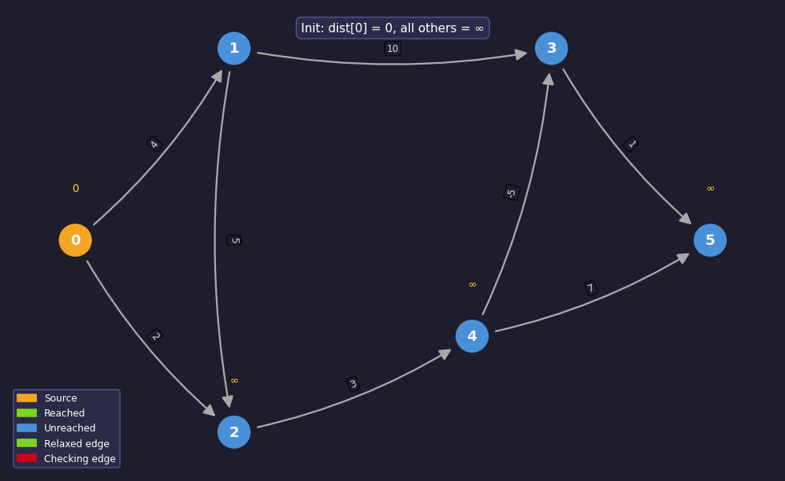
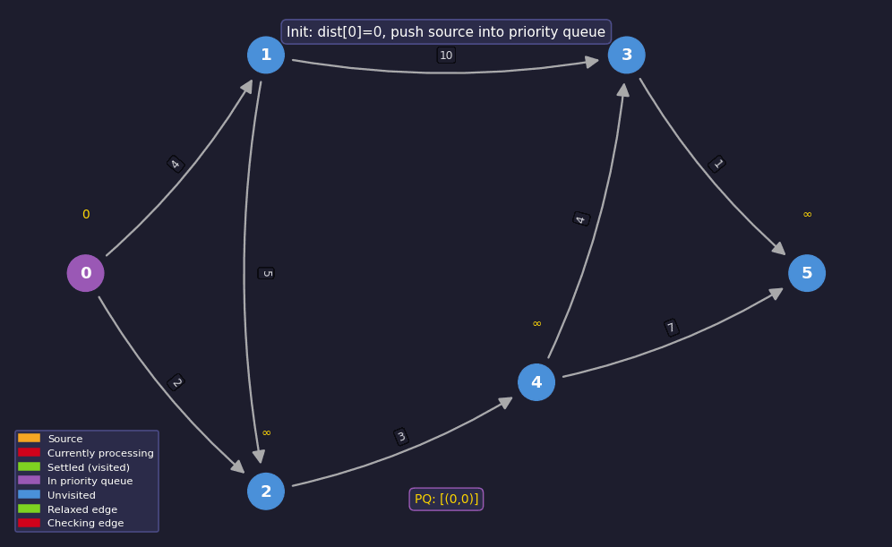

# Week 2 — Graph Algorithms

## 1. Shortest Path Algorithms

Finding the shortest route for an unweighted graph is easier as we can simply run a BFS and obtain the path, but now, we will look into weighted graphs.

### Bellman-Ford Algorithm

The **Bellman-Ford Algorithm** finds the shortest path from a starting node to all the nodes of the graph. The algorithm can process all kinds of graphs, unless it has a cycle with negative length. If the graph contains a negative cycle, the algorithm can detect this.

The algorithm keeps track of distances from the starting point to all nodes of the graph. Initially, the distance of the starting path is 0, those of all other nodes is infinite. The algorithm reduces the distances by finding edges that shorten the paths until it is not possible to reduce any further.



**Implementation**

```cpp
#include <bits/stdc++.h>
using namespace std;

int main() {
    int n, m, x;
    cin >> n >> m >> x; // n = nodes, m = edges, x = source

    vector<tuple<int,int,int>> edges(m);
    for (auto& [a, b, w] : edges)
        cin >> a >> b >> w;

    const int INF = 1e9;
    vector<int> distance(n + 1);

    for (int i = 1; i <= n; i++) distance[i] = INF;
    distance[x] = 0;

    for (int i = 1; i <= n - 1; i++) {
        for (auto e : edges) {
            int a, b, w;
            tie(a, b, w) = e;
            distance[b] = min(distance[b], distance[a] + w);
        }
    }

    for (int i = 1; i <= n; i++)
        cout << (distance[i] == INF ? -1 : distance[i]) << "\n";

    return 0;
}
```

The time complexity of the algorithm is $O(nm)$, because the algorithm goes through all $n-1$ nodes with their $m$ edges. If there are no negative cycles in the graph, all distances are final after $n-1$ rounds, because each shortest path can at most contain $n-1$ edges.

*A possible way to shorten the algorithm is to stop it if no distance can be reduced during a round.*

**Negative Cycles**

The Bellman-Ford algorithm can also be used to check if a graph has a cycle with negative length.

For example, the above graph contains a negative cycle $2 \to 3 \to 4 \to 2$ with length $-4$. If a cycle contains negative length, we can shorten the path infinitely many times, which is not meaningful.

A negative cycle can be detected by Bellman-Ford algorithm by running the algorithm $n$ rounds. If the distance is reduced in the $n^{th}$ round, then it contains a negative cycle.

**SPFA**

The **SPFA** (Shortest Path Faster Algorithm) is a variant of the Bellman-Ford algorithm, but rather than going to all the nodes and checking for each edge, SPFA selects its nodes intelligently.

The algorithm maintains a queue of nodes that might be used for reducing distances. First, the algorithm adds the starting node $x$ to the queue. Then, the algorithm always processes the first node in the queue, and when an edge $a \to b$ reduces the distance, $b$ is added to the queue.

The efficiency of the SPFA depends on the structure of the graph: the algorithm is often more efficient, but in some cases it can still be as slow as the Bellman-Ford algorithm, and its worst time complexity is $O(nm)$.

---

### Dijkstra's Algorithm

**Dijkstra's algorithm** finds the shortest paths from the starting node to all nodes of the graph, like the Bellman-Ford algorithm. *The benefit of Dijkstra's algorithm is that it is efficient for processing larger graphs.* However, the algorithm requires that there are no negative weight edges in the graph.

Dijkstra's algorithm maintains distances to each node and reduces it during the search. It is more efficient because it processes each edge in the graph once, using the fact that there are no negative edges.



One remarkable thing about this algorithm is that whenever a node is selected, its distance is final.

> ***How does it choose which node to go to?***
>
> *It always picks the unvisited node with the smallest known distance from the source at that moment.*
>
> *Think of it like this — you're at node 0, you can see two neighbors:*
>
> - *Node 1 at distance 4*
> - *Node 2 at distance 2*
>
> *Dijkstra says: "Node 2 is closer, go there first." Always the minimum. That's the greedy choice.*
>
> ---
>
> ***How does the priority queue enforce this?***
>
> *A priority queue (min-heap) is a data structure that always gives you the smallest element first when you pop from it.*
>
> *So instead of scanning all nodes to find the minimum each time (which is slow), you just:*
>
> ```
> push (distance, node) into the PQ
> pop  → always gives you the (smallest distance, node) automatically
> ```
>
> *Concretely in the GIF, the bottom bar shows the PQ state like:*
>
> ```
> PQ: [(0,0)]          ← only source at start
> PQ: [(2,2), (4,1)]   ← after processing node 0
> PQ: [(4,1), (5,4)]   ← after processing node 2
> ```
>
> *Every pop gives you the next closest unvisited node — no searching needed.*
>
> ---
>
> *The two ideas together: greedy choice (always go to minimum distance node) + priority queue (efficiently finds that minimum) = Dijkstra's algorithm.*

**Implementation**

The following implementation of Dijkstra's algorithm calculates the minimum distances from a node x to other nodes of the graph.

The graph is stored as adjacency lists so that adj[a] contains a pair (b,w) always when there is an edge from node a to node b with weight w.

An efficient implementation of Dijkstra's algorithm requires that it is possible to efficiently find the minimum distance node that has not been processed. An appropriate data structure for this is a priority queue that contains the nodes ordered by their distances. Using a priority queue, the next node to be processed can be retrieved in logarithmic time.

In the following code:

- the priority queue $q$ contains pairs of the form $(-d,x)$, meaning that the current distance to node $x$ is $d$.
- The array distance contains the distance to each node, and the array processed indicates whether a node has been processed.
- Initially the distance is $0$ to $x$ and $\infty$ to all other nodes.

```cpp
#include <bits/stdc++.h>
using namespace std;

int main() {
    int n, m, x;
    cin >> n >> m >> x;

    vector<vector<pair<int,int>>> adj(n + 1);
    for (int i = 0; i < m; i++) {
        int a, b, w;
        cin >> a >> b >> w;
        adj[a].push_back({b, w});
    }

    const int INF = 1e9;
    vector<int> distance(n + 1, INF);
    vector<bool> processed(n + 1, false);
    priority_queue<pair<int,int>> q;  // max-heap, stores (-d, x)

    distance[x] = 0;
    q.push({0, x});

    while (!q.empty()) {
        int a = q.top().second; q.pop();
        if (processed[a]) continue;
        processed[a] = true;
        for (auto u : adj[a]) {
            int b = u.first, w = u.second;
            if (distance[a] + w < distance[b]) {
                distance[b] = distance[a] + w;
                q.push({-distance[b], b});  // negative because max-heap
            }
        }
    }

    for (int i = 1; i <= n; i++)
        cout << (distance[i] == INF ? -1 : distance[i]) << "\n";

    return 0;
}
```

---

### Time and Complexity Analysis

**Bellman-Ford**

|  | Complexity |
| --- | --- |
| Time | O(V · E) |
| Space | O(V + E) |

- Outer loop runs **V-1** times
- Inner loop goes over **all E edges** each time
- Hence V × E

**Dijkstra**

|  | Complexity |
| --- | --- |
| Time | O((V + E) log E) |
| Space | O(V + E) |

- Each node is popped from PQ once → **V pops**, each costing **log E**
- Each edge triggers at most one push → **E pushes**, each costing **log E**
- Hence (V + E) log E

**Why Dijkstra is Faster**

Bellman-Ford blindly re-checks every edge V-1 times. Dijkstra uses the PQ to always pick the most promising node next, so it never wastes work on already-settled nodes.

The tradeoff — Bellman-Ford handles **negative edges**, Dijkstra doesn't.

---

## 2. Greedy Strategies in Graphs

A **greedy algorithm** makes the locally optimal choice at each step, hoping it leads to a globally optimal solution.

In graph problems, this means — at every decision point, pick the best available option **right now**, without looking ahead.

Dijkstra is the perfect example — at every step, pick the unvisited node with the smallest current distance. That's a greedy choice.

### Local vs Global Optimum

A **local optimum** is the best choice at a given step.
A **global optimum** is the best solution overall.

The danger with greedy algorithms — a locally optimal choice doesn't always lead to a globally optimal solution.

**Example where greedy works:**

```
S --1-- A --1-- E
 \             /
  4           /
   \         /
    B ---2--/
```

Greedy from S picks A (cost 1). Total S→A→E = 2, which is optimal.

**Example where greedy fails:**

```
S --1-- A --10-- E
 \               /
  3             /
   \           /
    B ---2----/
```

Greedy picks A (cost 1), total S→A→E = 11. But S→B→E = 5. Greedy failed.

> This is why **not every problem can be solved greedily** — you need to prove that the greedy choice is safe before using it.

### Proving Greedy Choices Mathematically

There are two standard proof techniques:

**1. Greedy Stays Ahead**

Show that after every step, the greedy solution is at least as good as any other solution.

*Used for: Dijkstra's Algorithm*

**Claim:** When a node $u$ is popped from the PQ, `dist[u]` is final — no shorter path exists.

**Proof by contradiction:**

Assume when we pop $u$, there exists a shorter path $P$ we haven't found yet. That path must go through some unvisited node $v$ at some point. But $v$ is in the PQ with:

$$\text{dist}[v] \geq \text{dist}[u]$$

Otherwise $v$ would have been popped first. So any path through $v$ has cost at least $\text{dist}[v] \geq \text{dist}[u]$. Adding more non-negative edges after $v$ only increases the cost further. So $P$ can't be shorter. **Contradiction.**

> This breaks with negative edges — a negative edge after $v$ could make $P$ shorter, invalidating the argument. This is why Dijkstra fails on negative edges.

**2. Exchange Argument**

Assume there's an optimal solution that differs from greedy. Show that you can swap the differing choice with the greedy choice without making things worse.

*Used for: Kruskal's and Prim's Algorithm*

**Claim:** The greedy choice (pick the cheapest edge) is always in some optimal solution.

**Proof structure:**

Take an optimal solution $O$ that differs from greedy solution $G$. Find the first edge $e$ where they differ — $G$ picked $e$, $O$ didn't.

Now take $O$ and swap in $e$, removing whatever edge $f$ it used instead. Show that:

$$\text{cost}(O \text{ with } e) \leq \text{cost}(O \text{ with } f)$$

Since $e$ was the greedy (cheapest) choice at that step:

$$\text{cost}(e) \leq \text{cost}(f)$$

So the swap doesn't make $O$ worse. Therefore the greedy choice is always safe.

**Summary**

|  | Greedy Stays Ahead | Exchange Argument |
| --- | --- | --- |
| Strategy | Show greedy is never behind | Show greedy can replace optimal without loss |
| Used for | Dijkstra | Kruskal's, Prim's |
| Direction | Forward — step by step | Backward — start from optimal, morph to greedy |

---

## 3. Minimum Spanning Trees (MST)

Given a **connected, weighted, undirected graph**, a spanning tree is a subgraph that:

- Connects **all nodes**
- Has **no cycles**
- Has exactly **n-1 edges** for n nodes

A **Minimum Spanning Tree** is the spanning tree with the **minimum total edge weight.**

**Example:**

```
1 --4-- 2
|       |
2       1
|       |
3 --3-- 4
```

Two possible spanning trees:

- 1-2, 2-4, 4-3 → cost = 4+1+3 = 8
- 1-3, 3-4, 4-2 → cost = 2+3+1 = 6  ← MST

There can be multiple MSTs if edges have equal weights, but the total cost is always the same.

### Prim's Algorithm

Prim's builds the MST by **growing it one node at a time** from a starting node.

**Idea:**

- Start from any node
- At each step, add the **cheapest edge** that connects a node already in the MST to a node outside it
- Repeat until all nodes are included

It is essentially Dijkstra but instead of tracking distance from source, you track the **cheapest edge to reach each node from the current MST.**

**Step by step (start from node 1):**

```
MST = {1}
Available edges: 1-2 (4), 1-3 (2)
Pick cheapest → 1-3 (2),  MST = {1, 3}

Available edges: 1-2 (4), 3-4 (3)
Pick cheapest → 3-4 (3),  MST = {1, 3, 4}

Available edges: 1-2 (4), 4-2 (1)
Pick cheapest → 4-2 (1),  MST = {1, 3, 4, 2}

Done. Total cost = 2+3+1 = 6
```

**State maintenance** — Prim's uses a priority queue storing `(edge_cost, node)` to efficiently pick the cheapest edge at each step, just like Dijkstra uses a PQ to pick the closest node.

### Kruskal's Algorithm

Kruskal's takes a completely different approach — instead of growing from a node, it looks at **all edges globally.**

**Idea:**

- Sort all edges by weight
- Go through them one by one
- Add an edge to the MST **only if it doesn't form a cycle**
- Stop when you have n-1 edges

**Step by step on the same example:**

```
Edges sorted: 4-2(1), 1-3(2), 3-4(3), 1-2(4)

Take 4-2 (1) → no cycle → add.  MST edges: {4-2}
Take 1-3 (2) → no cycle → add.  MST edges: {4-2, 1-3}
Take 3-4 (3) → no cycle → add.  MST edges: {4-2, 1-3, 3-4}
Take 1-2 (4) → forms cycle 1-3-4-2-1 → skip.

Done. Total cost = 1+2+3 = 6
```

The key question — **how do you efficiently check if adding an edge forms a cycle?** That's where DSU comes in.

**Implementation:**

```cpp
#include <bits/stdc++.h>
using namespace std;

vector<int> parent, rnk;

int find(int x) {
    if (parent[x] != x)
        parent[x] = find(parent[x]);
    return parent[x];
}

void unite(int x, int y) {
    x = find(x); y = find(y);
    if (x == y) return;
    if (rnk[x] < rnk[y]) swap(x, y);
    parent[y] = x;
    if (rnk[x] == rnk[y]) rnk[x]++;
}

int main() {
    int n, m;
    cin >> n >> m;

    vector<tuple<int,int,int>> edges(m);
    for (auto& [w, a, b] : edges)
        cin >> a >> b >> w;

    sort(edges.begin(), edges.end());  // sort by weight

    parent.resize(n+1); rnk.resize(n+1, 0);
    for (int i = 1; i <= n; i++) parent[i] = i;

    int mst_cost = 0;
    for (auto [w, a, b] : edges) {
        if (find(a) != find(b)) {
            unite(a, b);
            mst_cost += w;
        }
    }

    cout << mst_cost << "\n";
    return 0;
}
```

### Disjoint Set Union (DSU) / Union-Find

DSU is a data structure that tracks which nodes belong to the same **component.**

It supports two operations:

- `find(x)` → which component does x belong to?
- `unite(x, y)` → merge the components of x and y

**find(x)**

`find(x)` finds the **root** of x's component — the single representative node for that group.

Every node has a `parent`. Initially each node is its own parent:

```
parent = [1, 2, 3, 4]   ← everyone points to themselves
```

After some unions:

```
parent = [1, 1, 1, 3]   ← 2→1, 3→1, 4→3→1
```

```cpp
int find(int x) {
    if (parent[x] != x)
        parent[x] = find(parent[x]);  // path compression
    return parent[x];
}
```

**Path compression** — on the way back up the recursion, every node on the chain gets its parent set directly to the root:

```
Before: 4 → 3 → 1
After:  4 → 1,  3 → 1   ← both point directly to root now
```

So next time you call `find(4)`, it's O(1) — one step straight to root.

**unite(x, y)**

```cpp
void unite(int x, int y) {
    x = find(x); y = find(y);         // find roots of both
    if (x == y) return;                // already in same component
    if (rnk[x] < rnk[y]) swap(x, y); // make x the larger tree
    parent[y] = x;                     // attach smaller under larger
    if (rnk[x] == rnk[y]) rnk[x]++;  // update rank if equal
}
```

- Find roots first — you're merging **components**, not individual nodes
- If `find(x) == find(y)` → already connected → adding this edge forms a cycle → return
- **Union by rank** — always attach the shorter tree under the taller one to keep the tree flat
- Rank only increases when two trees of **equal rank** merge — the only case where the tree gets taller

> When used in Kruskal's — if `find(a) != find(b)`, the edge is safe to add. If `find(a) == find(b)`, it would form a cycle, skip it.

**Complexity**

| Algorithm | Time | Space |
| --- | --- | --- |
| Prim's (with PQ) | O((V + E) log E) | O(V + E) |
| Kruskal's | O(E log E) | O(V + E) |
| DSU (per operation) | O(α(V)) ≈ O(1) | O(V) |

$\alpha$ is the inverse Ackermann function — grows so slowly it is effectively constant for any practical input size.

---

## 4. Optimization Applications

The algorithms covered so far — Dijkstra, Bellman-Ford, Prim's, Kruskal's — are not just theoretical constructs. They are the building blocks for real-world optimization problems. The core idea is simple: **model your problem as a graph, then apply the right algorithm.**

The skill is not in knowing the algorithms, but in recognizing which graph model fits the problem at hand.

### Network Routing and Flow Optimization

**Network routing** is the most direct application of shortest path algorithms. In a computer network, routers are nodes, cables are edges, and latency or bandwidth is the weight. Finding the fastest route from one machine to another is literally Dijkstra's algorithm. This is how the **OSPF** (Open Shortest Path First) protocol works on the internet.

**Flow optimization** goes a step further — instead of just finding a path, the goal is to maximize how much can flow through a network simultaneously. Think of water pipes, road traffic, or data packets. This leads to **Max Flow** problems, where the graph model is the same but the question being asked is different.

> The difference between routing and flow: routing asks *which path*, flow asks *how much can move at once*.

### Cost Minimization in Wiring and Clustering

This is the direct application of **MST**.

**Wiring:** Given $n$ cities, connect all of them with the minimum total cable length. A direct cable between every pair is unnecessary — just enough connections so every city is reachable. That is exactly an MST. Run Kruskal's or Prim's and the problem is solved.

**Clustering:** The MST idea can be flipped around. Instead of minimizing connections, the goal is to **partition** nodes into $k$ groups where nodes in the same group are close to each other.

The approach — build the MST, then remove the $k-1$ most expensive edges. What remains are $k$ connected components, which are the clusters.

```
MST with 4 nodes:          Remove most expensive edge (5):

1 --2-- 2                  1 --2-- 2       3 --3-- 4
        |           →
        5                  Cluster 1       Cluster 2
        |
        3 --3-- 4
```

This is called **single-linkage clustering** and is one of the simplest clustering algorithms used in machine learning.

> Both wiring and clustering are the same problem framed differently — one asks for minimum cost to connect everything, the other asks where to cut to form groups.
